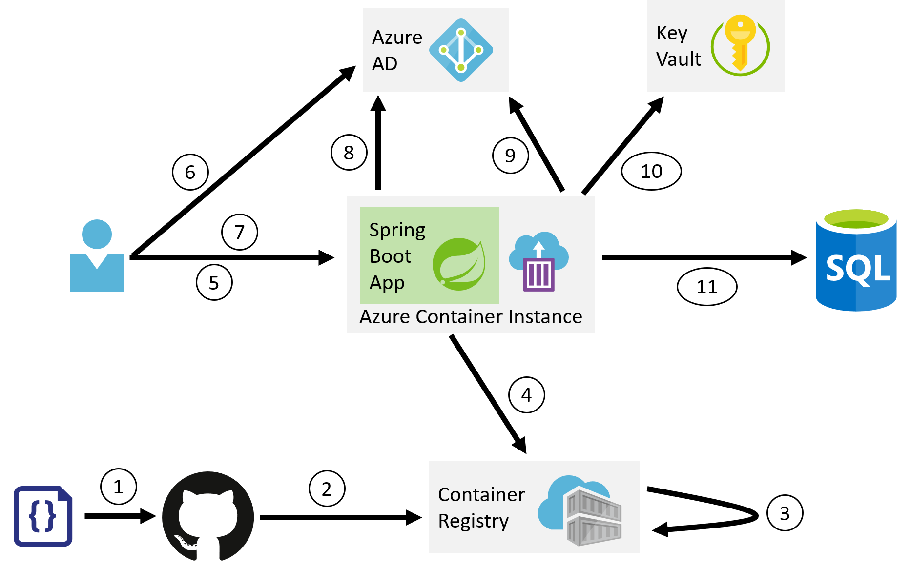

# spring_boot_aad_kv

Small demo of a dockerized Spring Boot web application with Azure AD and KeyVault.

This demo shows multiple aspects:

- It's a Spring Boot-based web application
- The web app is configured solely via environment variables (to be a good Docker citizen) and Azure KeyVault for confidential values
  - Specifically, the SQL Azure connection information (connection string, username and password) come in from KeyVault. 
- The web app authenticates users via Azure AD.
  - On the [/](http://localhost:8080/) endpoint, it enforces group membership. 
  - On the [/claims](http://localhost:8080/claims) endpoint, it prints out the user's security token's properties. 
  - On `GET /pet`, `POST /pet/create`, `GET /pet/123` and `DELETE /pet/123` we authenticate the user, and interact with SQL Azure in the back. 

## Overview

</img>

## Demo

- [MP4 Download](https://chrissapvideo.blob.core.windows.net/springboot/SpringBootOnAzure.mp4)

## misc links

- [Tutorial: Secure a Java web app using the Spring Boot Starter for Azure Active Directory](https://docs.microsoft.com/en-us/java/azure/spring-framework/configure-spring-boot-starter-java-app-with-azure-active-directory?view=azure-java-stable)
- [PetController](https://github.com/Azure-Samples/spring-data-jdbc-on-azure/blob/master/src/main/java/com/microsoft/azure/samples/spring/PetController.java)
- [Azure Key Vault Secrets Spring Boot Starter Sample](https://github.com/microsoft/azure-spring-boot/tree/master/azure-spring-boot-samples/azure-keyvault-secrets-spring-boot-sample)
- [Bootiful Azure: SQL-based data access with Microsoft SQL Server (2/6)](https://spring.io/blog/2019/01/07/bootiful-azure-sql-based-data-access-with-microsoft-sql-server-2-6)

## Docs

- [ARM template functions](https://docs.microsoft.com/en-us/azure/azure-resource-manager/resource-group-template-functions)
- [Microsoft.Sql/servers](https://docs.microsoft.com/en-us/azure/templates/microsoft.sql/2014-04-01/servers)
- [Microsoft.KeyVault/vaults](https://docs.microsoft.com/en-us/azure/templates/microsoft.keyvault/2018-02-14/vaults)
- [Microsoft.KeyVault/vaults/accessPolicies](https://docs.microsoft.com/en-us/azure/templates/microsoft.keyvault/2018-02-14/vaults/accesspolicies)
- [Microsoft.KeyVault/vaults/secrets](https://docs.microsoft.com/en-us/azure/templates/microsoft.keyvault/2018-02-14/vaults/secrets)
- [Microsoft.ContainerRegistry/registries](https://docs.microsoft.com/en-us/azure/templates/microsoft.containerregistry/2017-10-01/registries)
- [Microsoft.ContainerRegistry/registries/tasks](https://docs.microsoft.com/en-us/azure/templates/microsoft.containerregistry/2018-09-01/registries/tasks)
- [Microsoft.ContainerInstance/containerGroups](https://docs.microsoft.com/en-us/azure/templates/microsoft.containerinstance/2018-10-01/containergroups)
- [Microsoft.ManagedIdentity/userAssignedIdentities](https://docs.microsoft.com/en-us/azure/templates/microsoft.managedidentity/2018-11-30/userassignedidentities)
